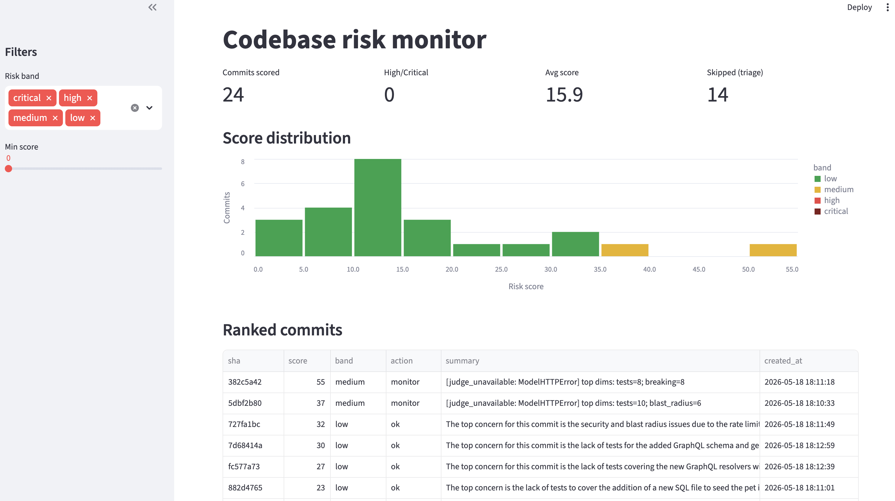

# Codebase Risk Monitor

An agentic framework that scores and ranks git commits by risk. It combines cheap deterministic signals with parallel LLM specialist agents to flag the commits most likely to cause incidents — before they're merged.

---

## Quick start

A pre-scanned demo database is included. Run the dashboard instantly:

```bash
git clone <repo-url>
cd codebase-risk-monitoring

python -m venv .venv
source .venv/bin/activate      # Windows: .venv\Scripts\activate

pip install -e .
risk-monitor dashboard
```

Opens at http://localhost:8501 — ranked commits, per-dimension breakdown, drill-down.

## Scan any repo yourself

```bash
# 1. Get a free Groq key at https://console.groq.com/keys 
# 2. Add it to .env
echo "GROQ_API_KEY=gsk_..." >> .env

# 3. Scan any local git repo
risk-monitor scan /path/to/any/repo --since HEAD~30
risk-monitor dashboard
```

Works on any language, any repo.

---

## What it does

Given a git repo, it:
1. Ingests commits (diff, files, author, timestamp)
2. Computes a cheap deterministic **triage score** — no LLM, instant
3. For commits above the threshold, runs **6 specialist LLM agents in parallel**, each scoring one risk dimension
4. Aggregates into a **0–100 risk score** with per-dimension rationale and `file:line` evidence
5. Stores results in SQLite and surfaces them in a CLI and Streamlit dashboard

---

## Architecture

```
git repo
  └─ Ingestor          pulls commits: diff, files changed, author, timestamp
       └─ Signal Extractor   deterministic triage score (no LLM, free)
            └─ Triage Gate   score < 20? skip LLM entirely → saves cost
                 └─ 6 Specialist Agents  ← run in PARALLEL via asyncio.gather
                      • Security
                      • Blast Radius
                      • Test Coverage
                      • Breaking Changes
                      • Migration / Data Safety
                      • Complexity
                 └─ Aggregator    weighted score (0–100) + sanity checks
                 └─ Judge Agent   1–2 sentence human-readable summary
       └─ SQLite store   cached by (sha, prompt_version, model_version)
            └─ CLI  /  Streamlit dashboard
```

---
## Demo



## The 6 risk dimensions

| Agent | What it looks for |
|---|---|
| **Security** | Secrets, auth/crypto changes, injection sinks (eval, shell=True, SQL concat), vulnerable deps |
| **Blast Radius** | Public APIs changed, shared utilities, how many callers are affected |
| **Test Coverage** | Did tests change with the code? Are risky paths covered? |
| **Breaking Changes** | Removed/renamed functions, changed API contracts, config key renames |
| **Migration / Data** | DROP TABLE, NOT NULL without backfill, destructive DB ops, no rollback plan |
| **Complexity** | Cyclomatic depth, god functions, copy-paste, dead code left in |

Each agent returns `{score: 0–10, confidence: 0–1, rationale, evidence: [file:line]}`.

---

## Key design decisions

### Triage gate first
Most commits are boring. A README fix, a seed data update — they don't need 7 LLM calls. Before touching any model, a deterministic scorer runs in milliseconds using only commit metadata (lines changed, files touched, sensitive path hits, test ratio, time of commit). Commits below the threshold are skipped. In practice, this gates ~50% of commits and saves half the cost.

### Multi-agent over one big prompt
Each specialist has a focused rubric and scores only its dimension. Benefits:
- All 6 run **in parallel** — wall time is ~1 LLM call, not 6
- Each is **independently tunable** — improve the security prompt without touching blast radius
- Each produces a **confidence score** — low-confidence findings get down-weighted in aggregation
- Each is **independently evaluatable** — you can test security precision separately

### Evidence required
Every non-zero score must cite `file:line`. If an agent returns a score with no evidence, the score is zeroed out automatically. This forces the model to ground its findings in the actual diff and makes every risk claim verifiable by the reviewer in < 30 seconds.

### Caching by (sha, prompt_version, model_version)
LLM calls are expensive. Re-scanning the same repo twice re-uses stored results — no tokens spent. Changing the prompt or swapping models produces new entries without losing old ones, enabling direct A/B comparison of scoring strategies.

### Prompt injection defense
Diffs can contain attacker-controlled text (commit messages, code comments with "ignore previous instructions"). Every diff is wrapped in `<diff>DATA</diff>` delimiters and agents are explicitly told the content is data, not instructions.

### No auto-blocking on LLM scores
LLM outputs are signals, not ground truth. The tool surfaces risk to reviewers — only deterministic rules (e.g. secret detected by regex) should hard-block. This prevents a hallucinating model from blocking a safe merge.

---

## Scoring

```
final_score = weighted_sum(dimension_scores × confidence) scaled to 0–100

Weights:
  security      30%   ← highest: a single auth bug can be catastrophic
  migration     20%   ← data loss is often irreversible
  blast_radius  15%
  breaking      15%
  tests         10%
  complexity    10%
```

Risk bands: LOW (0–34) · MEDIUM (35–59) · HIGH (60–79) · CRITICAL (80–100)

---

## Guardrails

| Guardrail | What it does |
|---|---|
| Secret scrubbing | Regex-strips API keys, tokens, private keys from diffs before LLM sees them |
| Diff size cap | Diffs > 12k tokens are chunked — never silently truncated |
| Binary/generated file filter | Skips lockfiles, images, minified JS — they blow context and add noise |
| Structured output validation | Pydantic schema enforced on every agent response; retries on malformed output |
| Evidence requirement | Non-zero score with no evidence → score zeroed out automatically |
| Rate limiting | Token-bucket limiter respects provider rate limits (25/min for Groq) |
| Read-only tools | Agents have no write access, no network calls beyond the LLM provider |

---

## CLI reference

```bash
risk-monitor scan   <repo>  [--since HEAD~20] [--limit N] [--force]
risk-monitor list           [--limit 20]
risk-monitor explain <sha>
risk-monitor dashboard      [--port 8501]
```

---

## Configuration (.env)

```bash
# Provider: "groq" (default, free) or "openrouter"
RISK_MONITOR_PROVIDER=groq
GROQ_API_KEY=gsk_...                       # free at console.groq.com/keys

# Models (Groq free tier defaults)
RISK_MONITOR_MODEL_SPECIALIST=llama-3.3-70b-versatile
RISK_MONITOR_MODEL_JUDGE=llama-3.3-70b-versatile

# Tuning
RISK_MONITOR_TRIAGE_THRESHOLD=20           # commits below this skip LLM
RISK_MONITOR_SENSITIVE_PATHS=auth,payments,migrations,secrets
```

---

## Tech stack

| Component | Choice | Why |
|---|---|---|
| LLM agents | PydanticAI | Type-safe structured outputs, clean multi-agent, retry logic built-in |
| LLM provider | Groq (default) | 30 req/min free, 14,400 req/day, fast LPU inference |
| Model routing | OpenRouter-compatible | Swap models via config, no code change |
| Models | llama-3.3-70b-versatile | Strong reasoning, reliable JSON, free on Groq |
| Git interface | GitPython | Full diff, blame, and history access |
| Store | SQLite | Zero-config, single file, cache by (sha, prompt, model) |
| Dashboard | Streamlit | Pure Python, runs in one command |
| Parallelism | asyncio.gather | All 6 agents fire simultaneously |

---

## What I'd add next

**Highest priority:**

1. **Tools for agents** — the single biggest quality improvement. A blast radius agent that can `grep` for callers, a security agent that can check CVE databases, a complexity agent that can read surrounding context — not just the raw diff.

2. **PR-level scoring** — commits are scored in isolation today. A series of individually safe commits that together replace an auth system would each score low. Scoring the full diff from merge base to HEAD catches this.

3. **Eval / calibration loop** — label past commits that caused prod incidents, measure whether the tool ranks those highest (precision@10, recall). Without ground truth labels, scores are plausible but unvalidated. This is the most important long-term investment.

4. **GitHub Action** — trigger on PR open/push, post a risk comment inline with the diff. That's where developers actually work.

**Production path:**
- SQLite → Postgres
- In-process asyncio → Celery + Redis task queue (handles large repos, multiple workers)
- Streamlit → Next.js with GitHub OAuth
- Rate limiter → Redis-backed (works across multiple workers)
- Add structured logging + Prometheus metrics

---

## Demo repo

The pre-scanned database contains results for [Petstore](https://github.com/astha200/Petstore) — a Go + GraphQL + React pet store with intentional security patterns (timing-attack mitigation, race-safe purchases, multi-tenant isolation). It has 30 commits across a range of risk levels, making it a good demo target.

Top findings on Petstore:

| Commit | Score | Finding |
|---|---|---|
| `57cc1097` | 71 HIGH | Removes core DB repository; new race-safe purchase logic has zero tests |
| `e6b74660` | 64 HIGH | Exposed DB credentials in seed data |
| `fc577a73` | 56 MED | Complete removal of GraphQL resolver infrastructure, no migration path |
| `debb7e8c` | 53 MED | Auth middleware deletion |
| `657c9dcb` | 52 MED | New auth + GraphQL paths with no test coverage |
